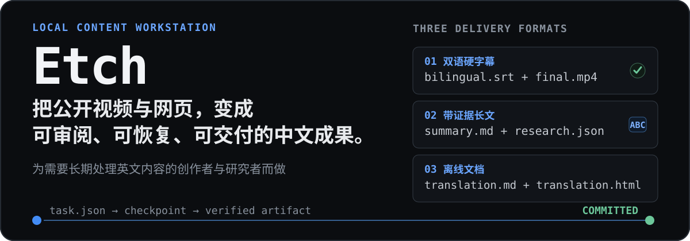
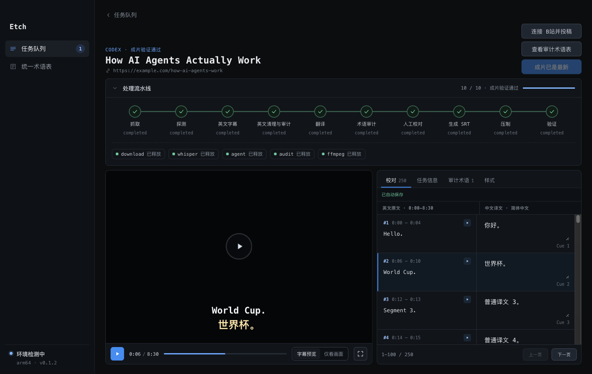
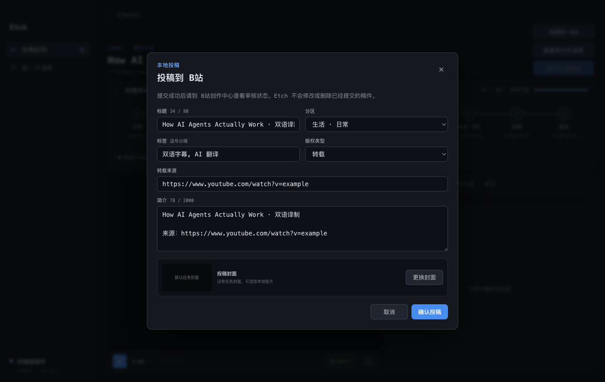

<p align="center">
  <a href="./README_EN.md">English</a> | <strong>中文文档</strong> | <a href="./README_JA.md">日本語</a>
</p>

<p align="center">
  
</p>

<p align="center">
  <strong>URL 进，可校对的双语硬字幕成片出；验证通过后，可选择由本机直接投稿到 B站。</strong>
</p>

<p align="center">
  <a href="https://github.com/bingjiang0611/Etch/releases/download/v0.1.2/Etch-0.1.2-arm64.dmg"><strong>下载 v0.1.2 DMG</strong></a>
  ·
  <a href="#3-步开始">3 步开始</a>
  ·
  <a href="#投稿到-b站">B站投稿</a>
  ·
  <a href="#能力与边界">能力与边界</a>
</p>

<p align="center">
  <sub>v0.1.2 · Apple Silicon · macOS 13.5+ · HTTP(S) URL 输入 · 公开 DMG 已含 B站投稿</sub>
</p>

## 一条可审阅、可恢复的成片流水线

<p align="center">
  
</p>

<p align="center">
  <sub>真实 Electron 界面；由 hermetic fixture 生成，不含个人账号或私人文件。</sub>
</p>

Etch 不把长视频翻译伪装成一次不可见的“AI 生成”。每个任务都保留阶段状态、失败原因、Provider session、候选产物和可恢复 checkpoint：

1. 从视频 URL 获取媒体与英文字幕；无字幕时使用 `mlx_whisper` 本地转写。
2. 通过 Claude、Codex、Qoder 或 OpenCode CLI 分批翻译，再执行英文源审计和全局术语审计。
3. 在视频旁逐句校对，预览术语修改的影响，然后生成双语 SRT。
4. 用 FFmpeg 压制硬字幕，经 ffprobe 验证后才视为成片；B站投稿是成片之后的独立可选步骤。

## 3 步开始

### 1. 安装

1. 从 [GitHub Releases](https://github.com/bingjiang0611/Etch/releases/latest) 下载 `Etch-0.1.2-arm64.dmg`。
2. 打开 DMG，把 `Etch.app` 拖入 `Applications`。
3. 首次启动若被 Gatekeeper 拦截，在 Finder 中右键 Etch 选择“打开”；仍被拦截时，到“系统设置 → 隐私与安全性”选择“仍要打开”。

> 当前 DMG 未经 Apple 公证，使用 ad-hoc 签名，尚未使用 Apple Developer ID。DMG 只是安装容器，不会绕过 Gatekeeper。

### 2. 检查本地工具

Etch 启动后会自动检测可执行文件、版本、关键能力和登录状态。开始任务前至少需要：

- Apple Silicon Mac，macOS 13.5+
- `yt-dlp`
- 带 `libass` 的 `ffmpeg` 与配套 `ffprobe`
- Python 3.12 与 `mlx_whisper`
- 至少一个已安装并登录的 `claude`、`codex`、`qodercli` 或 `opencode`

工具不在常规 `PATH` 时，可在设置页指定绝对路径 override。

### 3. 创建任务

在任务队列粘贴 1–50 个 HTTP(S) 视频 URL，选择 Provider，并按需填写翻译风格。任务可以停止，之后从最后已提交阶段继续。

当前版本：`0.1.2`。当前输入：**仅支持 HTTP(S) URL**；本地文件导入仍处于规划阶段。GitHub Release 提供 Apple Silicon DMG。

## 投稿到 B站

<p align="center">
  
</p>

<p align="center">
  <sub>v0.1.2 真实投稿确认界面；使用 hermetic fixture，不代表真实 B站账号端到端投稿已通过。</sub>
</p>

先在“设置 → B站投稿”使用具备投稿权限的账号扫码登录，并填写默认分区、标签和简介模板。完成后可以：

- 在新建任务时开启“完成后自动投稿”。
- 在已完成任务的工作台手动确认标题、分区、标签、简介、版权类型、来源和封面后提交。
- 在上传阶段停止后重新发起。若已进入提交阶段却没有可验证回执，Etch 会标记为“结果未知”，要求先到 B站创作中心确认，避免重复投稿。

投稿链路不需要 B站开放平台应用，不经过 Etch 自建云端或中转服务。V1 仅支持单账号、单投稿并发，不支持定时、多账号、审核轮询或稿件管理。

## 为什么是 Etch

- **人工审阅是正式阶段**：逐句中英对照、视频定位、自动保存、术语影响预览，而不是压制前的一个抽象勾选框。
- **可恢复，不猜成功**：从 `task.json`、durable run registry 和已提交阶段产物恢复；不把进程退出码 `0` 当作唯一成功证明。
- **Local-first**：下载、转写、文件管理、字幕生成和压制在本机完成；翻译数据是否离开设备取决于所选 Agent CLI。
- **Provider 可替换**：支持 Claude、Codex、Qoder、OpenCode 本地 CLI，不绑定单一 SDK 或常驻服务。

## 能力与边界

| 状态 | 能力 | 当前边界 |
| --- | --- | --- |
| Implemented | URL 到双语硬字幕成片 | 字幕获取/本地转写、四个 Agent CLI、术语审计、逐句校对、双语 SRT、FFmpeg 压制与 ffprobe 验证。 |
| Implemented | 可恢复任务 | `task.json` 是权威状态；产物提交受 lease、revision 与 fingerprint 约束。 |
| Implemented | B站直连投稿 | 公开 DMG 已包含 B站投稿：v0.1.2 支持单账号扫码登录、手动/自动投稿、单并发和可验证回执；真实账号 L3 投稿尚未验证。 |
| Partial | Provider、长媒体与公开发行 | 四端协议有自动化覆盖，但真实账号/服务端仍需当机验证；尚无全局磁盘预算、Developer ID、公证或自动更新。 |
| Planned | 本地文件导入 | Schema 已预留，但 UI、APFS clone/copy、空间检查和恢复链路尚未实现。 |

<details>
<summary><strong>从源码运行与打包</strong></summary>

验证环境使用 Node.js `22.22.1`：

```bash
git clone https://github.com/bingjiang0611/Etch.git
cd Etch
nvm use
npm ci
npm run dev
```

`npm run pack` 构建并验证 `dist/mac-arm64/Etch.app`；`npm run dist:mac` 构建、挂载并验证 `dist/Etch-0.1.2-arm64.dmg`。DMG 验证覆盖卷内 allowlist、App 签名、entitlements、arm64 架构、版本、最低系统版本，以及固定版 `biliup` sidecar 的架构、版本、执行权限和 SHA-256。

</details>

<details>
<summary><strong>验证层级</strong></summary>

| 层级 | 命令或路径 | 能证明什么 |
| --- | --- | --- |
| L1 | `npm run verify:l1`、`npm run pack`、`git diff --check` | 类型、lint、Vitest、renderer/main build 与目录包结构。 |
| 开发 E2E | `npm run e2e:hermetic` | 隔离 HOME/PATH 下的 UI、任务状态和进程合同；不证明真实 Provider/网络可用。 |
| B站 UI E2E | `npm run build && npx playwright test e2e/bilibili.spec.ts` | 扫码引导、投稿表单、自动投稿门禁、停止/重新发起和回执状态；不证明真实平台投稿成功。 |
| L2 | 安装 `/Applications/Etch.app` 后运行 `npm run smoke:installed` | 安装包 preload、菜单、durable IPC、任务恢复和受影响的真实工具路径。 |
| L3 | 真实 URL/媒体/已登录 Provider；B站需真实账号回执 | 完整用户路径；未逐项执行时不宣称端到端通过。 |

</details>

## 数据与隐私

- 媒体、字幕、日志、manifest 和成片保存在本地 workspace，默认为 `~/Movies/Bilingual Subs`。
- B站 Cookie 和 token 通过 Electron `safeStorage` 加密，不写入设置、任务 manifest 或日志；临时解密文件使用 `0600` 权限并在 sidecar 退出后删除。
- Etch 当前没有自建遥测或 Etch 云端；翻译数据是否离开设备及保留策略由所选 Agent CLI 及其后端决定。
- “删除全部产物”会把已登记任务目录移入 macOS 废纸篓；“仅移除记录”只在 Etch 中隐藏任务。删除本地任务不会删除已投稿稿件。

<details>
<summary><strong>常见故障</strong></summary>

- **工具不健康**：根据设置页的 executable、版本、登录状态或 `libass` 诊断，修正 `PATH` 或配置绝对路径 override。
- **异常退出后任务暂停**：先核对 durable run registry 和恢复摘要，避免旧 Provider 进程与恢复任务并发写入。
- **任务未出现在队列**：查看启动诊断中的无效 manifest 或重复 task ID。
- **Provider 失败**：确认对应 CLI 已登录且版本兼容；hermetic E2E 不能证明真实账号、网络和服务端当前可用。
- **B站投稿结果未知**：先到 B站创作中心确认是否已提交；Etch 不会自动重试“结果未知”记录。

</details>

## 项目文档

- [`CLAUDE.md`](./CLAUDE.md)：稳定架构约定与验证 profile。
- [`electron-builder.yml`](./electron-builder.yml)：macOS arm64 打包配置。
- [`scripts/verify-macos-dmg.mjs`](./scripts/verify-macos-dmg.mjs)：DMG 与卷内 App 校验。

## License

本仓库当前没有声明开源许可证。代码公开可见不等于授予复制、修改或再分发权利。
