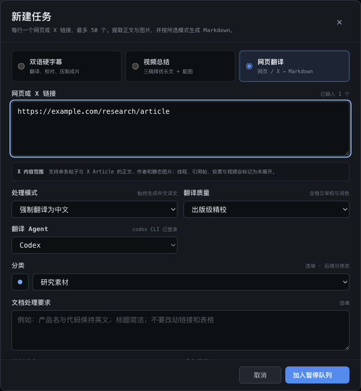
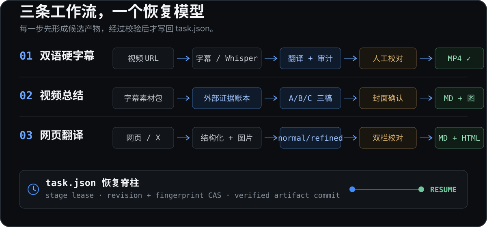

<p align="center">
  <a href="./README_EN.md">English</a> | <strong>中文文档</strong> | <a href="./README_JA.md">日本語</a>
</p>

<p align="center">
  
</p>

<p align="center">
  <a href="https://github.com/bingjiang0611/Etch/releases/download/v0.1.2/Etch-0.1.2-arm64.dmg"><strong>下载公开版 v0.1.2 DMG</strong></a>
  ·
  <a href="#第一次使用">第一次使用</a>
  ·
  <a href="#能力与边界">能力与边界</a>
  ·
  <a href="#从源码运行">从源码运行</a>
</p>

<p align="center">
  <sub>Apple Silicon · macOS 13.5+ · Local-first · HTTP(S) URL 输入</sub>
</p>

> [!IMPORTANT]
> 本页描述当前源码 `v0.2.14`（提交 `aac4bb9`）。公开安装包仍为 `v0.1.2`，不含本页新增的任务类型；要使用当前能力，请按“从源码运行”启动。

## 先看真实工作台

<p align="center">
  
</p>

<p align="center">
  <sub>真实 Electron 界面，由 hermetic fixture 生成；不含个人账号或私人文件。</sub>
</p>

Etch 不是一个只返回聊天文本的翻译入口。它把输入、Agent 调用、人工 checkpoint、验证和最终文件放进同一条本地任务流水线。当前源码提供三类成果：

- **双语硬字幕**：视频 URL → 英文字幕或本地 Whisper → 分批翻译与审计 → 逐句校对 → 双语 SRT → FFmpeg 压制并用 ffprobe 验证。
- **视频总结**：视频 URL → 字幕素材包 → 可追溯的外部 evidence ledger → A/B/C 三稿评分融合 → 中文长文与配图目录。
- **网页翻译**：普通网页或单条 X 内容 → 结构化 Markdown → normal/refined 翻译 → 双栏校对与验证 → 可选的独立离线 HTML。

<p align="center">
  
</p>

<p align="center">
  <sub>当前 aac4bb9 的真实新建任务界面；使用隔离的工具与 URL fixture，不访问外部网络。</sub>
</p>

## 三条工作流，一个恢复模型

<p align="center">
  
</p>

### 双语硬字幕

1. 从 YouTube、Vimeo 或 X/Twitter 的公开 HTTPS 视频 URL 获取媒体与字幕；无英文字幕时使用 `mlx_whisper` 本地转写。
2. 通过 Claude、Codex、Qoder 或 OpenCode 本地 CLI 分批翻译，并执行英文源审计与全局术语审计。
3. 在视频旁逐句校对，预览术语修改影响，生成双语 SRT。
4. 用带 `libass` 的 FFmpeg 压制硬字幕；只有 ffprobe 验证后的产物才会被提交为成片。

### 带 research / evidence 的视频总结

1. 复用可靠的英文底稿，生成带稳定素材 ID 的分析包。
2. research 阶段把可外部核验的主张写进 `research.json` evidence ledger；无法可靠检索时会停在 checkpoint 或记录限制，不伪造来源。
3. A/B/C 三份完整候选稿分别生成，经过六项评分、遗漏检查、融合与终稿自检后才写出中文长文。
4. 配图是独立 checkpoint：用户选择经实测的 Qoder 或 Codex，封面验收通过后才继续生成其余图片；也可以跳过配图。

> 这条链路已有自动化覆盖，但真实视频与真实 Provider 的完整 L3 尚未执行，因此状态仍是 **Partial**。

### 网页 / 文档翻译与离线发布

1. 安全抓取普通网页、单条 X status 或 X Article，固定来源快照，把静态图片本地化并清洗为结构化 Markdown。
2. `normal` 使用标准多阶段翻译；`refined` 额外执行独立审校与润色。两种模式都按批次提交，可在中断后恢复。
3. 在原文 / 成品双栏工作台校对，完成结构、链接、代码、表格与媒体完整性验证后导出 Markdown。
4. 通过验证的 Markdown 可再发布为**独立单文件 HTML**：先预览四个风格方向，再执行桌面与移动浏览器验收；最终文件不依赖远程脚本、样式或字体。

X 首版支持单条帖子与 X Article 的正文、作者和静态图片；线程、引用帖、投票与视频会明确标记为未展开。

## 为什么可恢复

- `task.json` 是任务状态权威；队列在启动时从任务目录重建。
- worker 提交需通过 stage lease、revision 与 input fingerprint 校验，退出码 `0` 不是成功的唯一依据。
- 每个阶段先写候选产物，验证后再原子提交；异常退出只从已提交 checkpoint 继续。
- 三类任务共享恢复语义，但各跑各的阶段；不属于当前任务类型的阶段在创建时即标为 `skipped`。
- 分类只是归档位：任务可在创建时或之后归类；移动、重命名或删除分类不会重跑流水线，也不会改写历史阶段状态。

## 第一次使用

### 1. 安装

1. 从 [GitHub Releases](https://github.com/bingjiang0611/Etch/releases/tag/v0.1.2) 下载 `Etch-0.1.2-arm64.dmg`。
2. 打开 DMG，把 `Etch.app` 拖入 `Applications`。
3. 首次启动若被 Gatekeeper 拦截，在 Finder 中右键 Etch 选择“打开”；仍被拦截时，到“系统设置 → 隐私与安全性”选择“仍要打开”。

当前 DMG 使用 Apple Development 开发签名，未经 Apple 公证，也未使用 Apple Developer ID。DMG 只是安装容器，不会绕过 Gatekeeper。

### 2. 检查本地工具

Etch 启动后会检测可执行文件、版本、关键能力和登录状态。

视频任务需要：

- Apple Silicon Mac，macOS 13.5+
- `yt-dlp`
- 带 `libass` 的 `ffmpeg` 与配套 `ffprobe`
- Python 3.12 与 `mlx_whisper`
- 至少一个已安装并登录的 `claude`、`codex`、`qodercli` 或 `opencode`

网页“只转 Markdown”不需要视频工具或 Agent；网页翻译仍需要一个已登录的 Agent CLI。工具不在常规 `PATH` 时，可在设置页指定绝对路径 override。

### 3. 创建第一个任务

在任务队列点击“新建任务”，选择一种成果，粘贴 URL，然后加入队列：

- 视频任务：每次可输入 1–50 个受支持平台的 HTTPS URL。
- 文档任务：每次可输入 1–50 个 HTTP(S) 普通网页或 X status URL。
- 所有任务都可停止；之后从最后已提交阶段继续。

当前只支持 URL 输入。本地文件导入仍处于规划阶段。

## 投稿到 B站

<p align="center">
  
</p>

<p align="center">
  <sub>v0.1.11 的真实投稿确认界面；hermetic fixture 不代表真实 B站账号端到端投稿已通过。</sub>
</p>

字幕成片验证完成后，可以在本机直接投稿到 B站。先在“设置 → B站投稿”扫码登录并填写默认分区、标签和简介模板，再选择自动投稿或在工作台手动确认。

凭证通过 Electron `safeStorage` 加密；上传结果没有可验证回执时，Etch 会标记为“结果未知”，要求先到 B站创作中心确认，避免重复投稿。V1 只支持单账号、单投稿并发，不支持定时、多账号、审核轮询或稿件管理。

## 能力与边界

| 状态 | 能力 | 当前边界 |
| --- | --- | --- |
| Implemented | URL 到双语硬字幕成片 | 字幕获取 / 本地转写、四个 Agent CLI、术语审计、逐句校对、双语 SRT、FFmpeg 压制与 ffprobe 验证。 |
| Implemented | 网页 / X 到 Markdown 与 HTML | 普通网页、单条 X status 与 X Article；静态图片本地化、normal/refined 可恢复翻译、双栏校对、结构验证、Markdown 导出与离线单文件 HTML。完整线程、引用帖、投票和 X 视频未展开。 |
| Implemented | 可恢复任务与分类 | `task.json` 权威状态、durable run registry、lease + revision/fingerprint 提交；分类不改变任务执行状态。 |
| Partial | 带证据的视频总结与配图 | research ledger、三稿评分融合、配图 checkpoint 和导出已有自动化覆盖；真实视频与真实 Provider 的完整 L3 尚未验证。 |
| Implemented | B站直连投稿 | 当前源码已实现扫码登录、手动 / 自动投稿、单并发与回执状态；公开 `v0.1.2` 不含此能力，真实账号 L3 尚未验证。 |
| Partial | Provider、长媒体与公开发行 | 四端协议有自动化覆盖，但真实账号 / 服务端需当机验证；尚无全局磁盘预算、Developer ID、公证或自动更新。 |
| Planned | 本地文件导入 | Schema 已预留；UI、APFS clone/copy、空间检查与恢复链路尚未实现。 |

## 数据、隐私与安全边界

- 媒体、字幕、日志、manifest 和成片保存在本地 workspace，默认路径为 `~/Movies/Bilingual Subs`。
- Etch 当前没有自建遥测或 Etch 云端；翻译数据是否离开设备及保留策略由所选 Agent CLI 与其后端决定。
- B站 Cookie 与 token 通过 Electron `safeStorage` 加密，不写入设置、任务 manifest 或日志；临时解密文件使用 `0600` 权限，并在 sidecar 退出后删除。
- Chrome 登录状态只在本机用于视频下载，不由 Etch 上传。
- “删除全部产物”会把已登记任务目录移入 macOS 废纸篓；“仅移除记录”只在 Etch 中隐藏任务。删除本地任务不会删除已投稿稿件。
- renderer 只通过窄 preload IPC 访问主进程，不启用 Node integration，也不提供任意命令 IPC。

## 从源码运行

验证环境使用 Node.js `22.22.1`：

```bash
git clone https://github.com/bingjiang0611/Etch.git
cd Etch
nvm use
npm ci
npm run dev
```

构建与打包：

```bash
npm run verify:l1
npm run pack
npm run dist:mac
```

`npm run pack` 构建并验证 `dist/mac-arm64/Etch.app`；`npm run dist:mac` 构建、挂载并验证 `dist/Etch-0.2.14-arm64.dmg`。DMG 验证覆盖卷内 allowlist、App 签名、entitlements、arm64 架构、版本、最低系统版本，以及固定版 `biliup` sidecar 的架构、版本、执行权限与 SHA-256。

<details>
<summary><strong>验证层级</strong></summary>

| 层级 | 命令或路径 | 能证明什么 |
| --- | --- | --- |
| L1 | `npm run verify:l1`、`npm run pack`、`git diff --check` | 类型、lint、Vitest、renderer/main build 与目录包结构。 |
| 开发 E2E | `npm run e2e:hermetic` | 隔离 HOME/PATH 下的 UI、任务状态与进程合同；不证明真实 Provider 或网络可用。 |
| B站 UI E2E | `npm run build && npx playwright test e2e/bilibili.spec.ts` | 扫码引导、投稿表单、自动投稿门禁、停止 / 继续与回执状态；不证明真实平台投稿成功。 |
| L2 | 安装 `/Applications/Etch.app` 后运行 `npm run smoke:installed` | 安装包 preload、菜单、durable IPC、任务恢复与受影响的真实工具路径。 |
| L3 | 真实 URL / 媒体 / 已登录 Provider；B站需真实账号回执 | 完整用户路径；未逐项执行时不宣称端到端通过。 |

</details>

<details>
<summary><strong>常见故障</strong></summary>

- **工具不健康**：根据设置页的 executable、版本、登录状态或 `libass` 诊断修正 `PATH`，也可配置绝对路径 override。
- **异常退出后任务暂停**：先核对 durable run registry 与恢复摘要，避免旧 Provider 进程和恢复任务并发写入。
- **任务未出现在队列**：查看启动诊断中的无效 manifest 或重复 task ID。
- **Provider 失败**：确认对应 CLI 已登录且版本兼容；hermetic E2E 不能证明真实账号、网络和服务端当前可用。
- **B站投稿结果未知**：先到 B站创作中心确认是否已提交；Etch 不自动重试“结果未知”记录。

</details>

## 项目文档

- [`CLAUDE.md`](./CLAUDE.md)：稳定架构约定与验证 profile。
- [`electron-builder.yml`](./electron-builder.yml)：macOS arm64 打包配置。
- [`scripts/verify-macos-dmg.mjs`](./scripts/verify-macos-dmg.mjs)：DMG 与卷内 App 校验。

## License

本仓库当前没有声明开源许可证。代码公开可见不等于授予复制、修改或再分发权利。
