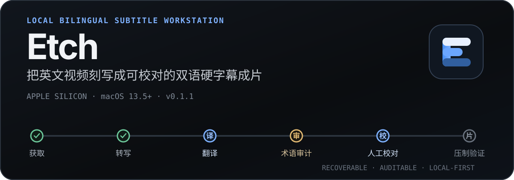

<p align="center">
  <a href="./README_EN.md">English</a> | <strong>中文文档</strong> | <a href="./README_JA.md">日本語</a>
</p>

<p align="center">
  
</p>

<p align="center">
  <strong>URL 进，可校对的双语成片出；验证完成后，还可从本机投稿到 B站。</strong><br>
  Etch 把字幕获取或本地转写、Agent CLI 翻译、术语审计、人工校对和 FFmpeg 压制组织成一条可恢复的本地流水线；B站投稿作为成片后的可选 sidecar 独立运行。
</p>

<p align="center">
  <a href="https://github.com/bingjiang0611/Etch/releases/latest"><strong>下载 v0.1.1 DMG</strong></a>
  ·
  <a href="#4-投稿到-b站">B站投稿</a>
  ·
  <a href="#能力与边界">能力与边界</a>
  ·
  <a href="#验证层级">验证层级</a>
</p>

<p align="center">
  
</p>

> 上图是当前 `main` 的真实 Electron 界面，使用 hermetic fixture 演示，不含个人账号信息；它证明 UI 合同，不代表真实 B站账号端到端投稿已经通过。

## 当前状态

- 当前版本：`0.1.1`。公开 DMG **尚不包含 B站投稿**。
- 主分支：B站投稿已实现，可从源码体验；将在下一版本 DMG 提供。
- 当前输入：**仅支持 HTTP(S) URL**；本地文件导入仍处于规划阶段。
- 当前发行：GitHub Release 提供 Apple Silicon DMG。
- 当前平台：Apple Silicon Mac，macOS 13.5 或更高版本。

## 从 URL 到成片，再到投稿

```text
视频 URL
  → 获取视频与英文字幕
  → 无字幕时使用 mlx_whisper 本地转写
  → Agent CLI 分批翻译
  → 历史术语约束与全局术语审计
  → 人工逐句校对并全局应用术语修改
  → 生成双语 SRT
  → FFmpeg 压制并用 ffprobe 验证
  → [可选] 确认投稿信息 → 本机直连 B站 → 保存可验证回执
```

Etch 不把这些步骤伪装成一次不可见的“AI 生成”。每个任务保留十阶段状态、失败原因、Provider session、不可变候选产物和可恢复 checkpoint；人工校对是正式流水线阶段。B站投稿状态独立于十阶段成片流水线，失败不会回滚已经验证的成片。

## 为什么是 Etch

- **Local-first**：下载、转写、文件管理、字幕生成和压制在本机完成；翻译数据是否离开设备取决于所选 Agent CLI。
- **可恢复**：异常退出后从 `task.json`、durable run registry 和阶段产物恢复，不把退出码 `0` 当作成功证明。
- **术语一致**：新任务参考历史视频术语表；术语修改可先预览影响 cue，再一次性应用到译文。
- **Provider 可替换**：支持 Claude、Codex、Qoder、OpenCode 本地 CLI，不绑定单一 SDK 或常驻服务。
- **人工可控**：逐句中英对照、视频定位、自动保存、审核 checkpoint、重新生成 SRT 与成片。
- **B站直连投稿（`main`）**：完成任务可手动或按模板自动投稿；凭据本地加密，上传由本机直连 B站，不经过 Etch 自建云端。
- **删除语义明确**：可以只隐藏任务记录，也可以把 Etch 管理的任务目录和产物移入 macOS 废纸篓。

## 最快开始

### 1. 安装

1. 从 [GitHub Releases](https://github.com/bingjiang0611/Etch/releases/latest) 下载 `Etch-0.1.1-arm64.dmg`。
2. 打开 DMG，把 `Etch.app` 拖入 `Applications`。
3. 首次启动若被 Gatekeeper 拦截，在 Finder 中右键 Etch 选择“打开”；仍被拦截时，到“系统设置 → 隐私与安全性”选择“仍要打开”。

当前 DMG 未经 Apple 公证，使用 ad-hoc 签名，尚未使用 Apple Developer ID。DMG 只是安装容器，不会绕过 Gatekeeper。

> `v0.1.1` 发布早于 B站投稿功能。如需体验投稿，请从当前 `main` 源码运行；不要把公开 DMG 与主分支能力混为一谈。

### 2. 检查本地工具

Etch 启动后会自动检测 executable、版本、关键能力和登录状态。开始任务前至少需要：

- Apple Silicon Mac，macOS 13.5+
- `yt-dlp`
- 带 `libass` 的 `ffmpeg` 与配套 `ffprobe`
- Python 3.12 与 `mlx_whisper`
- 至少一个已安装并登录的 `claude`、`codex`、`qodercli` 或 `opencode`

工具不在常规 `PATH` 时，可在设置页指定绝对路径 override。

### 3. 创建任务

在任务队列中输入一个或多个 HTTP(S) 视频 URL，选择 Provider，并按需填写翻译风格。任务创建后自动开始；处理中可以停止，之后从已提交阶段继续。

### 4. 投稿到 B站

该功能当前仅在 `main`。先在“设置 → B站投稿”使用具备投稿权限的 B站账号扫码登录，并填写默认分区、标签和简介模板。简介支持 `{title}` 与 `{source_url}` 占位符。之后可以：

- 在新建任务时开启“完成后自动投稿”；账号未登录或模板不完整时不能开启。
- 在已完成任务的工作台中点击“投稿到 B站”，确认标题、分区、标签、简介、版权类型、来源和封面后提交。成功加入本地投稿队列后，Etch 会记住本次分区、标签和版权类型，供下一次手动投稿自动回填；不会改动自动投稿模板。
- 上传阶段可以停止，之后从 Etch 重新发起投稿。若已进入提交阶段却没有取得可验证回执，Etch 会标记为“结果未知”，要求先到 B站创作中心确认，避免重复投稿。

Etch 不要求配置 B站开放平台应用；投稿链路不经过 Etch 自建云端或中转服务。V1 仅支持单账号、单投稿并发，不支持定时、多账号、审核轮询，也不修改或删除已经提交的稿件。

## 能力与边界

| 状态 | 能力 | 当前边界 |
| --- | --- | --- |
| Implemented | URL 任务队列 | 一次创建 1–50 个 URL 任务；支持暂停队列、停止、恢复和阶段并发。 |
| Implemented | 字幕获取与本地转写 | 优先获取英文字幕；失败时回退到 `mlx_whisper`，长媒体按窗口分段缓存和合并。 |
| Implemented | 四个 Agent CLI | Claude、Codex、Qoder、OpenCode 的检测、翻译、session resume 与结构化输出校验。 |
| Implemented | 翻译质量工作流 | 分批翻译、英文源审计、历史术语提示、全局术语审计、逐句编辑和局部修复。 |
| Implemented | 双语字幕与硬字幕 | 生成双语 SRT，支持紧凑/标准/大字三档预设，FFmpeg 压制后用 ffprobe 验证。 |
| Implemented | 可恢复任务状态 | `task.json` 是任务权威；产物提交受 lease、revision 与 fingerprint 约束。 |
| Implemented on `main` | B站直连投稿 | 单账号扫码登录、手动/自动投稿、单并发、上传阶段停止后重新发起与可验证回执；不含审核轮询、定时、多账号或稿件管理。尚未进入 v0.1.1 DMG。 |
| Partial | Provider 兼容性 | 自动化测试覆盖四端协议；真实账号、CLI 版本和服务端行为仍需在当前机器验证。 |
| Partial | 长媒体资源治理 | 已有确定性分段和续跑；尚无静音点切分、全局磁盘预算或自动缓存清理。 |
| Partial | 公开发行 | v0.1.1 提供 arm64 DMG 与 SHA-256，但不含 B站投稿；尚无 Developer ID、公证、自动更新或 CI release gate。 |
| Planned | 本地文件导入 | schema 已预留，但 UI、APFS clone/copy、空间检查和恢复链路尚未实现。当前仅支持 URL。 |

## 从源码运行

验证环境使用 Node.js `22.22.1`：

```bash
git clone https://github.com/bingjiang0611/Etch.git
cd Etch
nvm use
npm ci
npm run dev
```

构建并验证 Apple Silicon `.app`：

```bash
npm run pack
```

输出：`dist/mac-arm64/Etch.app`

构建、挂载并验证 DMG：

```bash
npm run dist:mac
```

输出：`dist/Etch-0.1.1-arm64.dmg`

DMG 验证会检查卷内 allowlist，并校验 `Etch.app` 的签名、entitlements、arm64 架构、版本、最低系统版本，以及固定版 `biliup` sidecar 的架构、版本、执行权限和 SHA-256。

## 验证层级

| 层级 | 命令或路径 | 能证明什么 |
| --- | --- | --- |
| L1 | `npm run verify:l1`、`npm run pack`、`git diff --check` | 类型、lint、Vitest、renderer/main build 与目录包结构。 |
| 开发 E2E | `npm run e2e:hermetic` | 使用隔离 HOME/PATH 与固定 fake tools 验证 UI、任务状态和进程合同；不证明真实 Provider/网络可用。 |
| B站 UI E2E | `npm run build && npx playwright test e2e/bilibili.spec.ts` | 扫码引导、投稿表单、自动投稿开关、停止/重新发起和回执状态；使用 hermetic fixture，不证明真实平台投稿成功。 |
| L2 | 安装 `/Applications/Etch.app` 后运行 `npm run smoke:installed` | 安装包 preload、菜单、durable IPC、任务恢复和受影响的真实工具路径。 |
| L3 | 真实 URL、真实媒体、四个已登录 Provider；B站需真实账号取得提交回执 | 完整用户路径。未逐项执行时不得宣称 MVP 或真实投稿全路径通过。 |

## 数据与隐私

- 媒体、字幕、日志、manifest 和成片保存在设置中的 workspace，默认位置为 `~/Movies/Bilingual Subs`。
- 设置、位置注册表、运行注册表、隐藏任务记录和全局术语表位于 Electron `userData` 目录。
- B站 Cookie 和 token 通过 Electron `safeStorage` 加密后独立保存，不写入设置、任务 manifest 或日志；投稿时只短暂解密到权限为 `0600` 的临时文件，sidecar 退出后立即删除。
- Etch 当前没有自建遥测或 Etch 云端。
- 翻译、审计与修复会把必要字幕文本、风格说明和术语上下文交给用户选择的 Agent CLI；数据是否离开设备以及保留策略由该 CLI 与其后端决定。
- 默认只向子进程传递 allowlist 环境变量；诊断日志记录变量名，不记录变量值。
- “删除全部产物”把已登记任务目录移入 macOS 废纸篓；“仅移除记录”只在 Etch 中隐藏任务，原目录保留。
- 删除本地任务不会删除已投稿的 B站稿件；已确认成功的稿件不会自动重投。

## 常见故障

<details>
<summary><strong>工具显示不健康</strong></summary>

先查看设置页显示的 executable、版本、登录状态或 `libass` 诊断，再修正 `PATH` 或配置绝对路径 override。

</details>

<details>
<summary><strong>异常退出后任务暂停</strong></summary>

Etch 会先核对 durable run registry，避免旧 Provider 进程与恢复任务并发写入。确认恢复摘要后再继续。

</details>

<details>
<summary><strong>任务没有出现在队列</strong></summary>

检查启动诊断中的无效 manifest 或重复 task ID。队列索引会在每次启动时从可读取的 `task.json` 重建。

</details>

<details>
<summary><strong>Provider 失败</strong></summary>

确认对应 CLI 已登录且版本兼容。Hermetic E2E 无法证明真实账号、网络和服务端当前正常。

</details>

<details>
<summary><strong>B站投稿结果未知</strong></summary>

先打开 B站创作中心确认稿件是否已经提交。为防止重复投稿，Etch 不会自动重试“结果未知”的记录。

</details>

## 项目文档

- [`CLAUDE.md`](./CLAUDE.md)：稳定架构约定与验证 profile。
- [`electron-builder.yml`](./electron-builder.yml)：macOS arm64 打包配置。
- [`scripts/verify-macos-dmg.mjs`](./scripts/verify-macos-dmg.mjs)：DMG 与卷内 App 校验。

## License

本仓库当前没有声明开源许可证。代码公开可见不等于授予复制、修改或再分发权利。
