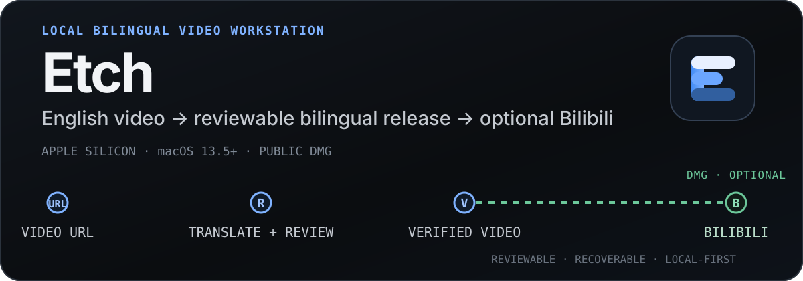
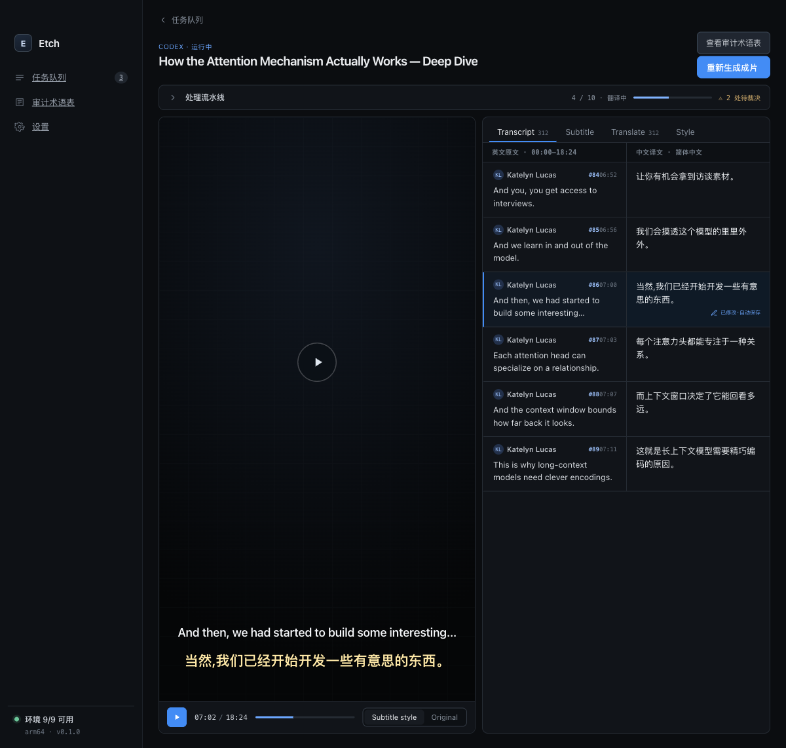
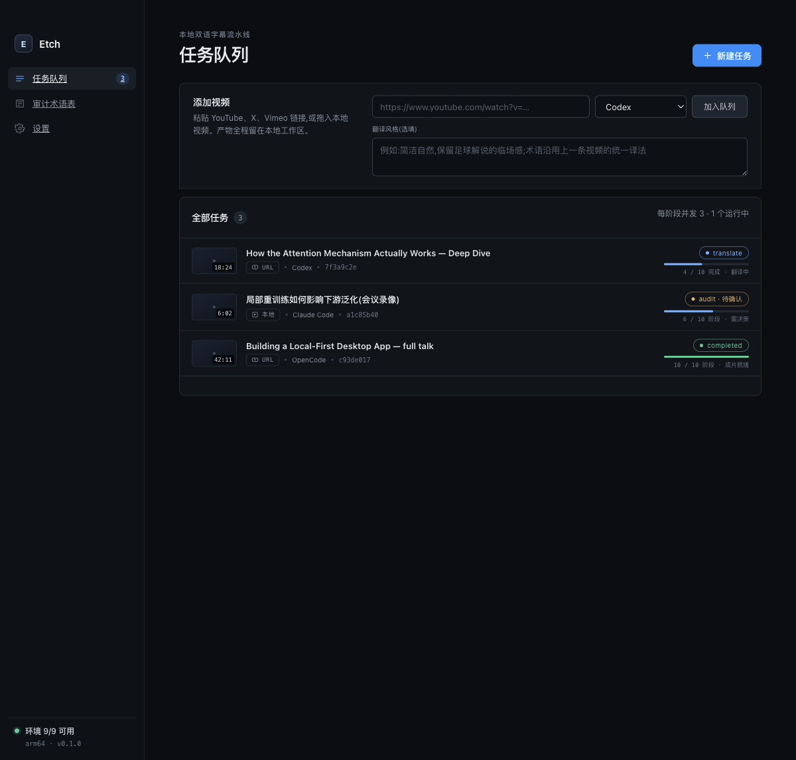
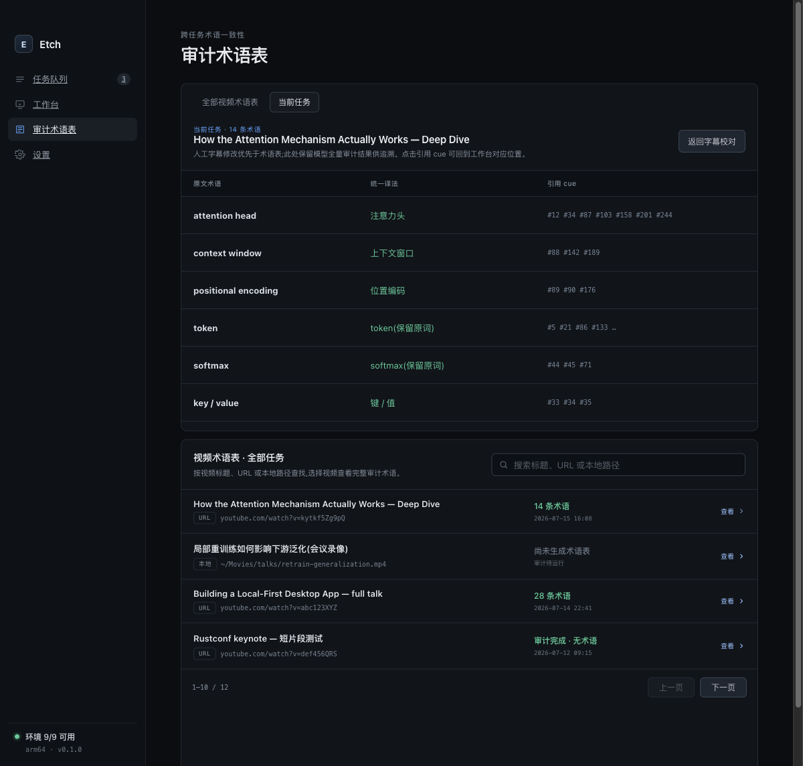

<p align="center">
  <strong>English</strong> | <a href="./README.md">中文文档</a> | <a href="./README_JA.md">日本語</a>
</p>

<p align="center">
  
</p>

<p align="center">
  <strong>URL in. Reviewable English-Chinese hard-subtitle video out.</strong><br>
  Etch organizes media acquisition, English subtitle retrieval or local transcription, Agent CLI translation, terminology audit, human review, SRT generation, and FFmpeg rendering into one recoverable local pipeline.
</p>

<p align="center">
  <a href="https://github.com/bingjiang0611/Etch/releases/latest"><strong>Download the latest DMG</strong></a>
  ·
  <a href="#run-from-source">Run from source</a>
  ·
  <a href="#capabilities-and-limits">Capabilities and limits</a>
  ·
  <a href="#verification-levels">Verification levels</a>
</p>

<p align="center">
  
</p>

> The image above is the Etch Workbench design preview. Actual data comes from your local tasks, media files, and selected Agent CLI. This README does not fabricate tokens, subtitles, or processing results.

## Current status

- Current version: `0.1.1`
- Current input: **HTTP(S) URLs only**; local file import is still planned.
- Current distribution: an Apple Silicon DMG is available from GitHub Releases.
- Current platform: Apple Silicon Mac running macOS 13.5 or later.

## From URL to final video

```text
Video URL
  → Fetch video and English subtitles
  → Fall back to local mlx_whisper transcription when needed
  → Translate in batches through an Agent CLI
  → Apply historical terminology constraints and run a global term audit
  → Review cues manually and apply terminology changes globally
  → Generate a bilingual SRT
  → Burn subtitles with FFmpeg and verify with ffprobe
```

Etch does not hide these steps behind an opaque “AI generation” button. Every task keeps ten-stage state, failure reasons, the Provider session, immutable candidate artifacts, and recoverable checkpoints. Human review is a first-class pipeline stage, not a repair screen added after failure.

## Why Etch

- **Local-first**: downloading, transcription, file management, subtitle generation, and rendering run on your Mac.
- **Recoverable**: interrupted work resumes from `task.json`, the durable run registry, and committed stage artifacts instead of trusting exit code `0`.
- **Terminology-aware**: new tasks use historical video glossaries; term edits can be previewed against affected cues and applied to the translation in one operation.
- **Provider-flexible**: Claude, Codex, Qoder, and OpenCode local CLIs are supported without requiring one fixed SDK or resident server.
- **Human-controlled**: side-by-side English and Chinese cues, video seeking, autosave, review checkpoints, and SRT/video regeneration.
- **Explicit deletion semantics**: hide only the task record, or move the Etch-managed task directory and artifacts to the macOS Trash.

## Quick start

### 1. Install

1. Download `Etch-0.1.1-arm64.dmg` from [GitHub Releases](https://github.com/bingjiang0611/Etch/releases/latest).
2. Open the DMG and drag `Etch.app` into `Applications`.
3. If Gatekeeper blocks the first launch, right-click Etch in Finder and choose **Open**. If it is still blocked, use **System Settings → Privacy & Security → Open Anyway**.

The current DMG is not notarized by Apple. It uses an ad-hoc signature rather than an Apple Developer ID. A DMG is only an installation container and does not bypass Gatekeeper.

### 2. Check local tools

Etch automatically checks executables, versions, required capabilities, and login state at startup. Before starting a task, you need:

- Apple Silicon Mac running macOS 13.5+
- `yt-dlp`
- `ffmpeg` with `libass`, plus the matching `ffprobe`
- Python 3.12 and `mlx_whisper`
- At least one installed and authenticated CLI: `claude`, `codex`, `qodercli`, or `opencode`

If a tool is not available on the normal `PATH`, set its absolute executable path on the Settings screen.

### 3. Create a task

Enter one or more HTTP(S) video URLs in the task queue, choose a Provider, and optionally describe the translation style. New tasks start automatically. A running task can be stopped and later resumed from its last committed stage.

## Capabilities and limits

| Status | Capability | Current boundary |
| --- | --- | --- |
| Implemented | URL task queue | Create 1–50 URL tasks at once; pause the queue, stop or resume tasks, and configure stage concurrency. |
| Implemented | Subtitle retrieval and local transcription | Prefer English subtitles; fall back to `mlx_whisper`, with windowed caching and timeline merging for long media. |
| Implemented | Four Agent CLIs | Detection, translation, session resume, and structured-output validation for Claude, Codex, Qoder, and OpenCode. |
| Implemented | Translation quality workflow | Batch translation, English source audit, historical terminology prompts, global terminology audit, cue editing, and targeted repair. |
| Implemented | Bilingual subtitles and hard-subtitle output | Generate bilingual SRT files, apply compact/standard/large presets, render with FFmpeg, and verify with ffprobe. |
| Implemented | Recoverable task state | `task.json` is authoritative; artifact commits are guarded by lease, revision, and fingerprint checks. |
| Partial | Provider compatibility | Automated tests cover all four adapter protocols; real accounts, CLI versions, and current server behavior still require verification on each machine. |
| Partial | Long-media resource management | Deterministic segmentation and resume are implemented; silence-aware splitting, a global disk budget, and automatic cache cleanup are not. |
| Partial | Public distribution | An arm64 DMG and SHA-256 are provided; Developer ID signing, notarization, auto-update, and a CI release gate are not. |
| Planned | Local file import | The schema reserves this input type, but the UI, APFS clone/copy, space checks, and recovery path are not implemented. URLs only for now. |

<details>
<summary><strong>More interface previews</strong></summary>

### Task queue



### Historical audit glossary



</details>

## Run from source

The verified development environment uses Node.js `22.22.1`:

```bash
git clone https://github.com/bingjiang0611/Etch.git
cd Etch
nvm use
npm ci
npm run dev
```

Build and verify the Apple Silicon `.app` directory:

```bash
npm run pack
```

Output: `dist/mac-arm64/Etch.app`

Build, mount, and verify the DMG:

```bash
npm run dist:mac
```

Output: `dist/Etch-0.1.1-arm64.dmg`

DMG verification checks the mounted-volume allowlist and validates the bundled app signature, entitlements, arm64 architecture, version, and minimum macOS version.

## Verification levels

| Level | Command or path | What it proves |
| --- | --- | --- |
| L1 | `npm run verify:l1`, `npm run pack`, `git diff --check` | Types, lint, Vitest, renderer/main builds, and the packaged app directory. |
| Development E2E | `npm run e2e:hermetic` | UI, task-state, and process contracts under an isolated HOME/PATH with deterministic fake tools. It does not prove real Provider or network availability. |
| L2 | Install `/Applications/Etch.app`, then run `npm run smoke:installed` | Packaged preload, menus, durable IPC, task recovery, and affected real tool paths. |
| L3 | Real URLs, media, and all four authenticated Providers | The complete user path. Do not claim full MVP coverage unless each path has actually been run. |

## Data and privacy

- Media, subtitles, logs, manifests, and rendered videos are stored in the configured workspace, which defaults to `~/Movies/Bilingual Subs`.
- Settings, location and run registries, hidden task records, and the global glossary live in Electron's `userData` directory.
- Etch currently has no first-party telemetry or Etch-hosted cloud service.
- Translation, audit, and repair send the required subtitle text, style instructions, and terminology context to the Agent CLI you select. Whether that content leaves the device and how long it is retained depend on that CLI and its backend.
- Child processes receive an allowlisted environment by default. Diagnostics record environment variable names, not values.
- **Delete all artifacts** moves the registered task directory to the macOS Trash. **Remove record only** hides the task in Etch and leaves the directory intact.

## Troubleshooting

<details>
<summary><strong>A tool is reported as unhealthy</strong></summary>

Check the executable, version, authentication, or `libass` diagnostic shown on the Settings screen, then fix `PATH` or configure an absolute executable override.

</details>

<details>
<summary><strong>A task is paused after an abnormal exit</strong></summary>

Etch checks the durable run registry before recovery so an old Provider process cannot write concurrently with the resumed task. Review the recovery summary before continuing.

</details>

<details>
<summary><strong>A task is missing from the queue</strong></summary>

Check startup diagnostics for an invalid manifest or duplicate task ID. The queue index is rebuilt from readable `task.json` files at every launch.

</details>

<details>
<summary><strong>A Provider fails</strong></summary>

Confirm that the matching CLI is authenticated and compatible. Hermetic E2E cannot prove that a real account, network, or Provider service is currently available.

</details>

## Project documents

- [`CLAUDE.md`](./CLAUDE.md): stable architecture rules and the project verification profile.
- [`electron-builder.yml`](./electron-builder.yml): macOS arm64 packaging configuration.
- [`scripts/verify-macos-dmg.mjs`](./scripts/verify-macos-dmg.mjs): DMG and bundled-app verification.

## License

This repository currently declares no open-source license. Publicly visible source code does not grant permission to copy, modify, or redistribute it.
