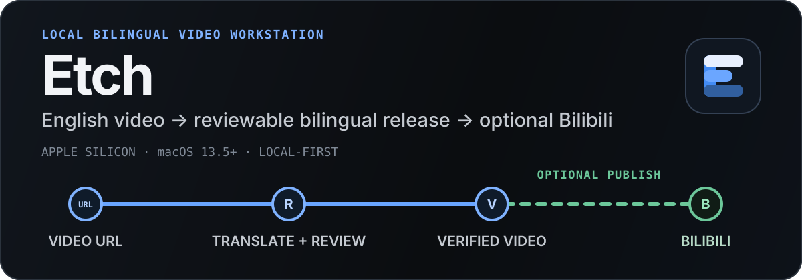

<p align="center">
  <strong>English</strong> | <a href="./README.md">中文文档</a> | <a href="./README_JA.md">日本語</a>
</p>

<p align="center">
  
</p>

<p align="center">
  <strong>URL in. A reviewable bilingual hard-subbed video out. Once verified, publish it directly to Bilibili from your Mac—if you choose.</strong>
</p>

<p align="center">
  <a href="https://github.com/bingjiang0611/Etch/releases/download/v0.2.38/Etch-0.2.38-arm64.dmg"><strong>Download the public v0.2.38 DMG</strong></a>
  ·
  <a href="#start-in-3-steps">Start in 3 steps</a>
  ·
  <a href="#publish-to-bilibili">Bilibili publishing</a>
  ·
  <a href="#capabilities-and-limits">Capabilities and limits</a>
</p>

<p align="center">
  <sub>Public v0.2.38 DMG · Apple Silicon · macOS 13.5+ · HTTP(S) URL input</sub>
</p>

> Public release `v0.2.38` includes all three task types: bilingual hard subtitles, video summaries, and web translation.

## A reviewable, recoverable video pipeline

<p align="center">
  
</p>

<p align="center">
  <sub>Real Electron UI generated with a hermetic fixture; no personal account data or private files.</sub>
</p>

Etch does not reduce long-video translation to one opaque “Generate with AI” action. Every task preserves its stage state, failure reasons, Provider session, candidate artifacts, and recoverable checkpoints:

1. Fetch the video and English subtitles from a URL; fall back to local `mlx_whisper` transcription when subtitles are unavailable.
2. Translate in batches through the Claude, Codex, Qoder, or OpenCode CLI, then audit the English source and terminology across the full video.
3. Review every cue beside the video, preview the impact of terminology changes, and generate a bilingual SRT.
4. Burn in the subtitles with FFmpeg and treat the output as complete only after ffprobe verification. Bilibili publishing remains an independent, optional step after completion.

Web translation uses a separate pipeline: safely fetch a normal webpage or one X status, normalize it into structured Markdown, localize static images, translate in recoverable normal/refined batches, review source and output side by side, then verify structure and media. Verified Markdown can be published independently as an offline single-file HTML page after a four-direction style preview and desktop/mobile browser checks. V1 supports one X post or X Article; threads, quotes, polls, and video are explicitly reported as not expanded.

## Start in 3 steps

### 1. Install

1. Download `Etch-0.2.38-arm64.dmg` from the verified [v0.2.38 GitHub Release](https://github.com/bingjiang0611/Etch/releases/tag/v0.2.38).
2. Open the DMG and drag `Etch.app` into `Applications`.
3. If Gatekeeper blocks the first launch, right-click Etch in Finder and choose **Open**. If it is still blocked, use **System Settings → Privacy & Security → Open Anyway**.

> The current DMG is not notarized by Apple. It uses an Apple Development signature rather than an Apple Developer ID. A DMG is only an installation container and does not bypass Gatekeeper.

### 2. Check local tools

At startup, Etch checks executable paths, versions, required capabilities, and authentication state. Video tasks need:

- An Apple Silicon Mac running macOS 13.5+
- `yt-dlp`
- `ffmpeg` with `libass`, plus the matching `ffprobe`
- Python 3.12 and `mlx_whisper`
- At least one installed and authenticated CLI: `claude`, `codex`, `qodercli`, or `opencode`

Web “convert to Markdown only” does not need video tools or a Provider. Web translation still requires one authenticated Agent CLI.

If a tool is not on the normal `PATH`, set its absolute executable path in Settings.

### 3. Create a task

Paste 1–50 HTTPS video URLs from a supported platform, or HTTP(S) normal webpage / X status URLs, choose the task type, and optionally describe the translation style. A task can be stopped and later resumed from its last committed stage.

Current public version: `0.2.38`. Input is limited to **HTTP(S) URLs**; local file import remains planned.

## Publish to Bilibili

This workflow is included in the public `v0.2.38` installer.

<p align="center">
  
</p>

<p align="center">
  <sub>Real publication UI shown with isolated test data; real-account L3 publishing remains unverified.</sub>
</p>

First connect a Bilibili account with publishing permission via QR code under **Settings → Bilibili publishing**, then configure the default category, tags, and description template. You can then:

- Enable **Publish to Bilibili when complete** while creating a task.
- Publish a completed task manually after confirming its title, category, tags, description, copyright type, source, and cover.
- Stop during upload and start the publication again. If submission begins without producing a verifiable receipt, Etch marks the result as **unknown** and asks you to check Bilibili Creator Center first, preventing duplicate submissions.

The publishing path requires no Bilibili Open Platform application and does not pass through an Etch-hosted cloud or relay service. V1 supports one account and one publication at a time; it does not support scheduling, multiple accounts, review-status polling, or post management.

## Why Etch

- **Human review is a first-class stage**: compare English and Chinese cue by cue, seek the video, autosave edits, and preview the impact of terminology changes—instead of relying on an abstract checkbox before rendering.
- **Recoverable without guessing success**: resume from `task.json`, the durable run registry, and committed stage artifacts; process exit code `0` is never the sole proof of success.
- **Local-first**: downloading, transcription, file management, subtitle generation, and rendering run on your Mac. Whether translation data leaves the device depends on the Agent CLI you select.
- **Provider-flexible**: use the Claude, Codex, Qoder, or OpenCode local CLI without binding the workflow to one SDK or resident service.

## Capabilities and limits

| Status | Capability | Current boundary |
| --- | --- | --- |
| Implemented | URL to bilingual hard-subtitle video | Subtitle retrieval/local transcription, four Agent CLIs, terminology audit, cue-by-cue review, bilingual SRT generation, FFmpeg rendering, and ffprobe verification. |
| Implemented | Webpage / X to Markdown and HTML | Normal webpages and one X status, body cleanup, static-image localization, recoverable normal/refined translation or conversion only, side-by-side review, structural verification, Markdown export, and offline single-file HTML publication after a four-direction preview. Full threads, quotes, polls, and X video are not expanded yet. |
| Implemented | Recoverable tasks | `task.json` is authoritative; artifact commits are guarded by lease, revision, and fingerprint checks. |
| Partial | Video summary (three-draft long-form article with illustrations) | New tasks can be created as "video summary": subtitle extraction, an analysis pack, an external-evidence ledger, three scored drafts merged into one final Chinese article, and 8-12 illustrations that can be previewed in the workbench and exported. Illustration requires the user to pick the verified Qoder or Codex path at a checkpoint; after the cover passes review, each remaining image is generated and committed independently. Complete L3 summarization with a real video and real Provider remains unverified. |
| Implemented | Direct Bilibili publishing | Current source implements single-account QR login, manual/automatic publishing, one concurrent publication, and verifiable receipts. The public `v0.2.38` installer includes this workflow; real-account L3 publishing remains unverified. |
| Partial | Providers, long media, and public distribution | Automated tests cover all four Provider protocols, but real accounts and current server behavior require on-machine verification. There is no global disk budget, Developer ID signing, notarization, or auto-update. |
| Planned | Local file import | The schema reserves this input type, but the UI, APFS clone/copy, space checks, and recovery path are not implemented. |

<details>
<summary><strong>Run from source and package</strong></summary>

The verified development environment uses Node.js `22.22.1`:

```bash
git clone https://github.com/bingjiang0611/Etch.git
cd Etch
nvm use
npm ci
npm run dev
```

`npm run pack` builds and verifies `dist/mac-arm64/Etch.app`; `npm run dist:mac` builds, mounts, and verifies `dist/Etch-0.2.38-arm64.dmg`. DMG verification covers the mounted-volume allowlist, app signature, entitlements, arm64 architecture, version, minimum macOS version, and the pinned `biliup` sidecar's architecture, version, executable permissions, and SHA-256.

</details>

<details>
<summary><strong>Verification levels</strong></summary>

| Level | Command or path | What it proves |
| --- | --- | --- |
| L1 | `npm run verify:l1`, `npm run pack`, `git diff --check` | Types, lint, Vitest, renderer/main builds, and the packaged app directory. |
| Development E2E | `npm run e2e:hermetic` | UI, task-state, and process contracts under an isolated HOME/PATH; it does not prove real Provider or network availability. |
| Bilibili UI E2E | `npm run build && npx playwright test e2e/bilibili.spec.ts` | QR-login guidance, the publication form, automatic-publication gating, stop/restart behavior, and receipt states; it does not prove publication to the real platform. |
| L2 | Install `/Applications/Etch.app`, then run `npm run smoke:installed` | Packaged preload, menus, durable IPC, task recovery, and affected real tool paths. |
| L3 | Real URLs/media and authenticated Providers; Bilibili requires a real-account receipt | The complete user path. Do not claim end-to-end coverage unless each path has actually been run. |

</details>

## Data and privacy

- Media, subtitles, logs, manifests, and rendered videos stay in the local workspace, which defaults to `~/Movies/Bilingual Subs`.
- Bilibili cookies and tokens are encrypted with Electron `safeStorage` and never written to settings, task manifests, or logs. The temporary decrypted file has `0600` permissions and is deleted when the sidecar exits.
- Etch currently has no first-party telemetry or Etch-hosted cloud. Whether translation data leaves the device—and how long it is retained—depends on the Agent CLI and its backend.
- **Delete all artifacts** moves the registered task directory to the macOS Trash; **Remove record only** hides it in Etch. Deleting a local task does not delete a submitted Bilibili post.

<details>
<summary><strong>Troubleshooting</strong></summary>

- **A tool is unhealthy**: use the executable, version, authentication, or `libass` diagnostic in Settings, then fix `PATH` or configure an absolute path override.
- **A task is paused after an abnormal exit**: check the durable run registry and recovery summary so an old Provider process cannot write alongside the resumed task.
- **A task is missing from the queue**: check startup diagnostics for an invalid manifest or duplicate task ID.
- **A Provider fails**: confirm that the matching CLI is authenticated and compatible. Hermetic E2E cannot prove that a real account, network, or Provider service is currently available.
- **A Bilibili publication result is unknown**: check Bilibili Creator Center before trying again. Etch does not automatically retry an **unknown** result.

</details>

## Project documents

- [`CLAUDE.md`](./CLAUDE.md): stable architecture rules and the project verification profile.
- [`electron-builder.yml`](./electron-builder.yml): macOS arm64 packaging configuration.
- [`scripts/verify-macos-dmg.mjs`](./scripts/verify-macos-dmg.mjs): DMG and bundled-app verification.

## License

This repository currently declares no open-source license. Publicly visible source code does not grant permission to copy, modify, or redistribute it.
