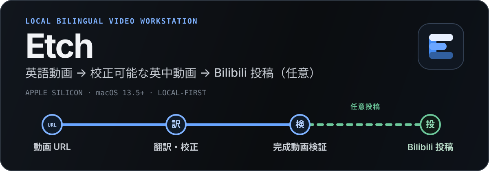

<p align="center">
  <a href="./README_EN.md">English</a> | <a href="./README.md">中文文档</a> | <strong>日本語</strong>
</p>

<p align="center">
  
</p>

<p align="center">
  <strong>URL を入れれば、校正できる英中字幕の焼き込み済み動画に。検証後は、Mac から直接 Bilibili へ投稿できます。</strong>
</p>

<p align="center">
  <a href="https://github.com/bingjiang0611/Etch/releases/download/v0.2.45/Etch-0.2.45-arm64.dmg"><strong>公開版 v0.2.45 DMG をダウンロード</strong></a>
  ·
  <a href="#3-ステップで開始">3 ステップで開始</a>
  ·
  <a href="#bilibili-へ投稿">Bilibili 投稿</a>
  ·
  <a href="#機能と制約">機能と制約</a>
</p>

<p align="center">
  <sub>公開 v0.2.45 DMG · Apple Silicon · macOS 13.5+ · HTTP(S) URL 入力</sub>
</p>

> 公開版 `v0.2.45` には、英中ハード字幕、動画要約、Web 翻訳の 3 種類のタスクが含まれています。

## 確認でき、途中から再開できる動画制作フロー

<p align="center">
  
</p>

<p align="center">
  <sub>実際の Electron UI。個人アカウントや私用ファイルを含まない hermetic fixture で生成しています。</sub>
</p>

Etch は、長尺動画の翻訳を中身の見えない一度きりの「AI 生成」にしません。各タスクに段階ごとの状態、失敗理由、Provider session、候補成果物、再開可能な checkpoint を残します。

1. 動画 URL からメディアと英語字幕を取得し、字幕がなければ `mlx_whisper` でローカル文字起こしを行います。
2. Claude、Codex、Qoder、OpenCode のいずれかの CLI で分割翻訳し、英語原文の監査と全体の用語監査を実行します。
3. 動画を見ながら cue ごとに校正し、用語変更の影響を確認してから英中 SRT を生成します。
4. FFmpeg で字幕を焼き込み、ffprobe の検証を通過した時点で完成です。Bilibili 投稿はその後に行う、独立した任意のステップです。

Web 翻訳は独立したパイプラインで処理します。通常の Web ページまたは 1 件の X status を安全に取得し、構造化 Markdown への正規化、静止画像のローカル化、再開可能な normal/refined 分割翻訳、原文と成果物の対照校正、構造とメディアの検証を行います。検証済み Markdown は、4 方向のスタイルプレビューとデスクトップ/モバイル検証を経て、オフライン単一ファイル HTML として独立公開できます。V1 は X の単一投稿と X Article に対応し、thread、引用投稿、poll、動画は展開していないことを明示します。

## 3 ステップで開始

### 1. インストール

1. 検証済みの [GitHub Release v0.2.45](https://github.com/bingjiang0611/Etch/releases/tag/v0.2.45) から `Etch-0.2.45-arm64.dmg` をダウンロードします。
2. DMG を開き、`Etch.app` を `Applications` にドラッグします。
3. 初回起動時に Gatekeeper でブロックされた場合は、Finder で Etch を右クリックして「開く」を選択します。それでも開けない場合は、「システム設定 → プライバシーとセキュリティ」から「このまま開く」を選びます。

> 現在の DMG は Apple の公証を受けておらず、Apple Developer ID ではなく Apple Development 開発署名を使用しています。DMG はインストール用コンテナであり、Gatekeeper を回避するものではありません。

### 2. ローカルツールを確認

Etch は起動時に、実行ファイル、バージョン、必要な機能、ログイン状態を自動検出します。動画タスクには次の環境が必要です。

- macOS 13.5 以降を搭載した Apple Silicon Mac
- `yt-dlp`
- `libass` 対応の `ffmpeg` と対応する `ffprobe`
- Python 3.12 と `mlx_whisper`
- インストール済みかつログイン済みの `claude`、`codex`、`qodercli`、`opencode` のいずれか

Web の「Markdown 変換のみ」は動画ツールも Provider も不要です。Web 翻訳モードでは、ログイン済みの Agent CLI が 1 つ必要です。

通常の `PATH` で見つからないツールは、設定画面で実行ファイルの絶対パスを override として指定できます。

### 3. タスクを作成

タスクキューに対応プラットフォームの HTTPS 動画 URL、または HTTP(S) の通常 Web ページ / X status URL を 1～50 件貼り付け、タスク種別を選び、必要に応じて翻訳スタイルを入力します。実行中のタスクは停止でき、最後に確定した段階から再開できます。

現在の公開バージョンは `0.2.45` です。入力は **HTTP(S) URL のみ**で、ローカルファイルの取り込みはまだ計画段階です。

## Bilibili へ投稿

このフローは公開 `v0.2.45` インストーラーに含まれています。

<p align="center">
  
</p>

<p align="center">
  <sub>隔離テストデータを使った実際の投稿確認画面です。実アカウントによる L3 投稿は未検証です。</sub>
</p>

まず「設定 → B站投稿」で、投稿権限のあるアカウントを QR コードで接続し、既定のカテゴリ、タグ、説明文テンプレートを設定します。その後、次の操作ができます。

- 新規タスクの作成時に「完成後に自動投稿」を有効にする。
- 完了したタスクの Workbench から、タイトル、カテゴリ、タグ、説明文、著作権区分、転載元、カバー画像を確認して手動投稿する。
- アップロード中に停止し、Etch から改めて投稿する。送信段階に入った後で検証可能なレシートを取得できなかった場合は「結果不明」と記録し、重複投稿を避けるため、先に Bilibili クリエイターセンターで確認を求めます。

投稿に Bilibili オープンプラットフォームのアプリ設定は不要で、Etch 独自のクラウドや中継サービスも経由しません。V1 は 1 アカウントで複数タスクの同時投稿に対応します。予約投稿、複数アカウント、審査状況のポーリング、投稿済み動画の管理には未対応です。

## Etch を選ぶ理由

- **人手校正を正式な工程として扱う**：英中 cue の対照表示、動画位置への移動、自動保存、用語変更の影響確認を備え、焼き込み前の抽象的なチェックだけで済ませません。
- **再開でき、成功を推測しない**：`task.json`、durable run registry、確定済みの段階成果物から復旧し、プロセスの終了コード `0` だけを成功の根拠にしません。
- **Local-first**：ダウンロード、文字起こし、ファイル管理、字幕生成、焼き込みは Mac 上で実行します。翻訳データが端末外へ送信されるかどうかは、選択した Agent CLI に依存します。
- **Provider を切り替えられる**：Claude、Codex、Qoder、OpenCode のローカル CLI に対応し、単一の SDK や常駐サービスに固定されません。

## 機能と制約

| 状態 | 機能 | 現在の制約 |
| --- | --- | --- |
| Implemented | URL から英中字幕の焼き込み済み動画まで | 字幕取得またはローカル文字起こし、4 種類の Agent CLI、用語監査、cue ごとの校正、英中 SRT、FFmpeg 焼き込み、ffprobe 検証に対応。 |
| Implemented | Web ページ / X から Markdown / HTML | 通常の Web ページと単一 X status の取得、本文クリーニング、静止画像のローカル化、再開可能な normal/refined 翻訳または変換のみ、対照校正、構造検証、Markdown 書き出し、4 方向プレビュー後のオフライン単一ファイル HTML 公開に対応。完全な thread、引用投稿、poll、X 動画は未展開。 |
| Implemented | 再開可能なタスク | `task.json` を正本とし、成果物の確定を lease、revision、fingerprint で保護。 |
| Partial | 動画要約（3 稿選抜の長文 + 挿絵） | 新規タスク作成時に「動画要約」を選択できます：字幕抽出 → 素材分析パック → 外部証拠台帳 → A/B/C の 3 稿を採点して融合 → 中国語の長文と 8-12 枚の挿絵。checkpoint で検証済みの Qoder または Codex を選び、表紙の検収後に残りの画像を 1 枚ずつ生成・永続化します。実動画と実 Provider を使った完全な L3 要約は未検証。 |
| Implemented | Bilibili への直接投稿 | 現在のソースに、1 アカウントの QR コード接続、手動・自動投稿、複数タスクの同時投稿、検証可能なレシートを実装。公開 `v0.2.45` インストーラーにも収録済みで、実アカウントによる L3 投稿は未検証。 |
| Partial | Provider、長尺メディア、一般配布 | 4 種類のプロトコルは自動テスト済みですが、実アカウントと現在のサーバー挙動は端末ごとの確認が必要です。全体ディスク予算、Developer ID、公証、自動更新は未実装。 |
| Planned | ローカルファイルの取り込み | Schema は予約済みですが、UI、APFS clone/copy、空き容量チェック、復旧経路は未実装。 |

<details>
<summary><strong>ソースからの実行とパッケージ作成</strong></summary>

検証済みの開発環境では Node.js `22.22.1` を使用します。

```bash
git clone https://github.com/bingjiang0611/Etch.git
cd Etch
nvm use
npm ci
npm run dev
```

`npm run pack` は `dist/mac-arm64/Etch.app` を構築・検証し、`npm run dist:mac` は `dist/Etch-0.2.45-arm64.dmg` を構築、マウント、検証します。DMG 検証では、ボリューム内の allowlist、App の署名、entitlements、arm64 アーキテクチャ、バージョン、最低 macOS バージョンに加え、固定版 `biliup` sidecar のアーキテクチャ、バージョン、実行権限、SHA-256 を確認します。

</details>

<details>
<summary><strong>検証レベル</strong></summary>

| レベル | コマンドまたは経路 | 検証できること |
| --- | --- | --- |
| L1 | `npm run verify:l1`、`npm run pack`、`git diff --check` | 型、lint、Vitest、renderer/main build、ディレクトリ版 App の構造。 |
| 開発 E2E | `npm run e2e:hermetic` | 隔離した HOME/PATH での UI、タスク状態、プロセス契約。実 Provider やネットワークの利用可否は証明しません。 |
| Bilibili UI E2E | `npm run build && npx playwright test e2e/bilibili.spec.ts` | QR コード接続の案内、投稿フォーム、自動投稿の条件、停止後の再実行、レシート状態。実プラットフォームへの投稿成功は証明しません。 |
| L2 | `/Applications/Etch.app` をインストール後、`npm run smoke:installed` | パッケージ版 preload、メニュー、durable IPC、タスク復旧、影響する実ツールの経路。 |
| L3 | 実 URL、実メディア、ログイン済み Provider。Bilibili は実アカウントの投稿レシートが必要 | 完全なユーザー経路。各項目を実行していない場合、エンドツーエンド通過とは表明しません。 |

</details>

## データとプライバシー

- メディア、字幕、ログ、manifest、完成動画はローカルワークスペースに保存されます。既定値は `~/Movies/Bilingual Subs` です。
- Bilibili の Cookie と token は Electron `safeStorage` で暗号化し、設定、タスク manifest、ログには書き込みません。一時的な復号ファイルには `0600` 権限を設定し、sidecar の終了後に削除します。
- Etch は独自のテレメトリーや Etch 運営のクラウドを持ちません。翻訳データが端末外へ送信されるか、どの程度保持されるかは、選択した Agent CLI とそのバックエンドに依存します。
- 「すべての成果物を削除」は登録済みのタスクディレクトリを macOS のゴミ箱へ移動し、「記録のみ削除」は Etch 上でタスクを非表示にするだけです。ローカルタスクを削除しても、Bilibili へ投稿済みの動画は削除されません。

<details>
<summary><strong>トラブルシューティング</strong></summary>

- **ツールが正常ではない**：設定画面の実行ファイル、バージョン、ログイン状態、`libass` 診断を確認し、`PATH` を修正するか絶対パスの override を設定します。
- **異常終了後にタスクが一時停止している**：durable run registry と復旧概要を確認し、古い Provider プロセスと復旧タスクの同時書き込みを避けます。
- **タスクがキューに表示されない**：起動診断に無効な manifest や重複した task ID がないか確認します。
- **Provider が失敗する**：対象 CLI のログイン状態と互換性を確認します。Hermetic E2E は、実アカウント、ネットワーク、サーバーが現在利用できることまでは証明しません。
- **Bilibili 投稿の結果が不明**：Bilibili クリエイターセンターで投稿済みか確認します。Etch は「結果不明」の記録を自動で再試行しません。

</details>

## プロジェクト文書

- [`CLAUDE.md`](./CLAUDE.md)：安定したアーキテクチャ規約と検証プロファイル。
- [`electron-builder.yml`](./electron-builder.yml)：macOS arm64 のパッケージ設定。
- [`scripts/verify-macos-dmg.mjs`](./scripts/verify-macos-dmg.mjs)：DMG とボリューム内 App の検証。

## License

このリポジトリには現在、オープンソースライセンスが明記されていません。ソースコードが公開されていても、複製、変更、再配布を許可するものではありません。
