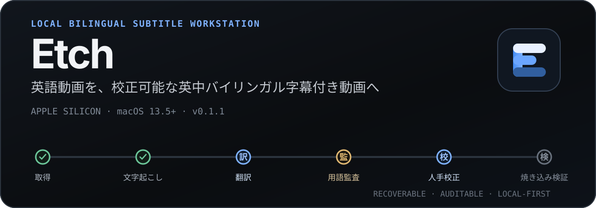

<p align="center">
  <a href="./README_EN.md">English</a> | <a href="./README.md">中文文档</a> | <strong>日本語</strong>
</p>

<p align="center">
  
</p>

<p align="center">
  <strong>URL を入力。校正可能な英中バイリンガル字幕付き動画を出力。</strong><br>
  Etch は動画取得、英語字幕の取得またはローカル文字起こし、Agent CLI 翻訳、用語監査、人手校正、SRT 生成、FFmpeg 焼き込みを、再開可能なローカルパイプラインとしてまとめます。
</p>

<p align="center">
  <a href="https://github.com/bingjiang0611/Etch/releases/latest"><strong>最新 DMG をダウンロード</strong></a>
  ·
  <a href="#ソースから実行">ソースから実行</a>
  ·
  <a href="#機能と制約">機能と制約</a>
  ·
  <a href="#検証レベル">検証レベル</a>
</p>

<p align="center">
  
</p>

> 上の画像は Etch Workbench のデザインプレビューです。実際のデータはローカルタスク、メディアファイル、選択した Agent CLI から取得されます。この README では token、字幕、処理結果を捏造していません。

## 現在の状態

- 現在のバージョン：`0.1.1`
- 現在の入力：**HTTP(S) URL のみ**。ローカルファイル取り込みは計画段階です。
- 現在の配布：GitHub Releases で Apple Silicon 用 DMG を提供しています。
- 対応環境：macOS 13.5 以降を搭載した Apple Silicon Mac。

## URL から完成動画まで

```text
動画 URL
  → 動画と英語字幕を取得
  → 字幕がなければ mlx_whisper でローカル文字起こし
  → Agent CLI で分割翻訳
  → 過去の用語制約を適用し、全体の用語監査を実行
  → cue を人手校正し、用語変更を訳文全体へ適用
  → 英中バイリンガル SRT を生成
  → FFmpeg で字幕を焼き込み、ffprobe で検証
```

Etch は、これらの工程を不透明な「AI 生成」ボタンに隠しません。各タスクには 10 段階の状態、失敗理由、Provider session、不変の候補成果物、再開可能な checkpoint が保存されます。人手校正は失敗後の修復画面ではなく、正式なパイプライン段階です。

## Etch を使う理由

- **Local-first**：ダウンロード、文字起こし、ファイル管理、字幕生成、焼き込みを Mac 上で実行します。
- **再開可能**：終了コード `0` だけを信用せず、`task.json`、durable run registry、確定済み段階成果物から中断した処理を再開します。
- **用語の一貫性**：新しいタスクでは過去動画の用語集を参照します。用語変更が影響する cue を事前確認し、訳文へ一括適用できます。
- **Provider を選択可能**：Claude、Codex、Qoder、OpenCode のローカル CLI に対応し、単一 SDK や常駐サーバーに固定されません。
- **人が制御可能**：英中 cue の並列表示、動画シーク、自動保存、校正 checkpoint、SRT と完成動画の再生成を備えます。
- **削除の意味が明確**：タスク記録だけを非表示にするか、Etch が管理するタスクディレクトリと成果物を macOS のゴミ箱へ移動するかを選べます。

## クイックスタート

### 1. インストール

1. [GitHub Releases](https://github.com/bingjiang0611/Etch/releases/latest) から `Etch-0.1.1-arm64.dmg` をダウンロードします。
2. DMG を開き、`Etch.app` を `Applications` にドラッグします。
3. 初回起動時に Gatekeeper でブロックされた場合は、Finder で Etch を右クリックして **開く** を選択します。それでもブロックされる場合は、**システム設定 → プライバシーとセキュリティ → このまま開く** を使用します。

現在の DMG は Apple の公証を受けていません。Apple Developer ID ではなく ad-hoc 署名を使用しています。DMG はインストール用コンテナにすぎず、Gatekeeper を回避するものではありません。

### 2. ローカルツールを確認

Etch は起動時に executable、バージョン、必要な機能、ログイン状態を自動検出します。タスクを開始するには、少なくとも次が必要です。

- macOS 13.5 以降を搭載した Apple Silicon Mac
- `yt-dlp`
- `libass` 対応の `ffmpeg` と対応する `ffprobe`
- Python 3.12 と `mlx_whisper`
- インストールおよび認証済みの `claude`、`codex`、`qodercli`、`opencode` のいずれか

通常の `PATH` でツールを検出できない場合は、設定画面で executable の絶対パスを指定します。

### 3. タスクを作成

タスクキューへ 1 件以上の HTTP(S) 動画 URL を入力し、Provider を選び、必要に応じて翻訳スタイルを指定します。新規タスクは自動的に開始されます。処理中のタスクは停止でき、最後に確定した段階から再開できます。

## 機能と制約

| 状態 | 機能 | 現在の制約 |
| --- | --- | --- |
| Implemented | URL タスクキュー | 1～50 件の URL タスクを一括作成。キューの一時停止、タスクの停止・再開、段階ごとの並行数設定に対応。 |
| Implemented | 字幕取得とローカル文字起こし | 英語字幕を優先して取得し、失敗時は `mlx_whisper` へフォールバック。長時間メディアはウィンドウ単位でキャッシュし、タイムラインを統合。 |
| Implemented | 4 種類の Agent CLI | Claude、Codex、Qoder、OpenCode の検出、翻訳、session resume、構造化出力検証に対応。 |
| Implemented | 翻訳品質ワークフロー | 分割翻訳、英語原文監査、過去用語プロンプト、全体用語監査、cue 編集、部分修復に対応。 |
| Implemented | バイリンガル字幕と焼き込み動画 | 英中 SRT を生成し、コンパクト・標準・大字プリセットを適用。FFmpeg で焼き込み、ffprobe で検証。 |
| Implemented | 再開可能なタスク状態 | `task.json` を正本とし、成果物の確定を lease、revision、fingerprint で保護。 |
| Partial | Provider 互換性 | 自動テストで 4 種類の adapter protocol を検証。実アカウント、CLI バージョン、現在のサーバー挙動は各端末での確認が必要。 |
| Partial | 長時間メディアのリソース管理 | 決定論的な分割と再開は実装済み。無音区間ベースの分割、全体ディスク予算、自動キャッシュ削除は未実装。 |
| Partial | 一般配布 | arm64 DMG と SHA-256 を提供。Developer ID 署名、公証、自動更新、CI release gate は未実装。 |
| Planned | ローカルファイル取り込み | schema には予約されていますが、UI、APFS clone/copy、容量確認、復旧経路は未実装です。現在は URL のみ。 |

<details>
<summary><strong>その他の画面プレビュー</strong></summary>

### タスクキュー


### 過去動画の監査用語集


</details>

## ソースから実行

検証済みの開発環境では Node.js `22.22.1` を使用します。

```bash
git clone https://github.com/bingjiang0611/Etch.git
cd Etch
nvm use
npm ci
npm run dev
```

Apple Silicon 用 `.app` ディレクトリを構築して検証します。

```bash
npm run pack
```

出力：`dist/mac-arm64/Etch.app`

DMG を構築、マウント、検証します。

```bash
npm run dist:mac
```

出力：`dist/Etch-0.1.1-arm64.dmg`

DMG 検証では、マウントされたボリュームの allowlist を確認し、同梱 App の署名、entitlements、arm64 architecture、バージョン、最低 macOS バージョンを検証します。

## 検証レベル

| レベル | コマンドまたは経路 | 検証できること |
| --- | --- | --- |
| L1 | `npm run verify:l1`、`npm run pack`、`git diff --check` | 型、lint、Vitest、renderer/main build、App ディレクトリパッケージ。 |
| 開発 E2E | `npm run e2e:hermetic` | 隔離された HOME/PATH と固定 fake tools による UI、タスク状態、プロセス契約。実 Provider やネットワークの可用性は証明しません。 |
| L2 | `/Applications/Etch.app` をインストール後、`npm run smoke:installed` | パッケージ版 preload、メニュー、durable IPC、タスク復旧、影響を受ける実ツール経路。 |
| L3 | 実 URL、実メディア、認証済みの 4 Provider | 完全なユーザー経路。すべてを実行していない場合、MVP 全経路の通過を宣言しません。 |

## データとプライバシー

- メディア、字幕、ログ、manifest、完成動画は設定した workspace に保存されます。既定値は `~/Movies/Bilingual Subs` です。
- 設定、location/run registry、非表示タスク記録、グローバル用語集は Electron の `userData` ディレクトリに保存されます。
- 現在の Etch には独自テレメトリや Etch 運営のクラウドサービスはありません。
- 翻訳、監査、修復では、必要な字幕テキスト、スタイル指示、用語コンテキストを選択した Agent CLI へ渡します。データが端末外へ送信されるか、どれだけ保持されるかは、その CLI とバックエンドの方針に依存します。
- 子プロセスには既定で allowlist 済み環境変数だけを渡します。診断ログには環境変数名を記録し、値は記録しません。
- **すべての成果物を削除** は登録済みタスクディレクトリを macOS のゴミ箱へ移動します。**記録のみ削除** は Etch 上でタスクを非表示にし、ディレクトリを残します。

## トラブルシューティング

<details>
<summary><strong>ツールが正常ではないと表示される</strong></summary>

設定画面に表示される executable、バージョン、認証、`libass` 診断を確認し、`PATH` を修正するか executable の絶対パスを指定します。

</details>

<details>
<summary><strong>異常終了後にタスクが一時停止している</strong></summary>

Etch は復旧前に durable run registry を確認し、古い Provider プロセスと再開タスクが同時に書き込むことを防ぎます。復旧概要を確認してから続行してください。

</details>

<details>
<summary><strong>タスクがキューに表示されない</strong></summary>

起動診断で無効な manifest または重複 task ID が報告されていないか確認します。キュー index は起動ごとに読み取り可能な `task.json` から再構築されます。

</details>

<details>
<summary><strong>Provider が失敗する</strong></summary>

対応する CLI が認証済みで互換性があることを確認します。Hermetic E2E では、実アカウント、ネットワーク、Provider service が現在利用可能であることまでは証明できません。

</details>

## プロジェクト文書

- [`CLAUDE.md`](./CLAUDE.md)：安定したアーキテクチャ規約とプロジェクト検証 profile。
- [`electron-builder.yml`](./electron-builder.yml)：macOS arm64 packaging 設定。
- [`scripts/verify-macos-dmg.mjs`](./scripts/verify-macos-dmg.mjs)：DMG と同梱 App の検証。

## License

このリポジトリには現在、オープンソースライセンスが明記されていません。ソースコードが公開されていても、複製、変更、再配布の許可を意味しません。
